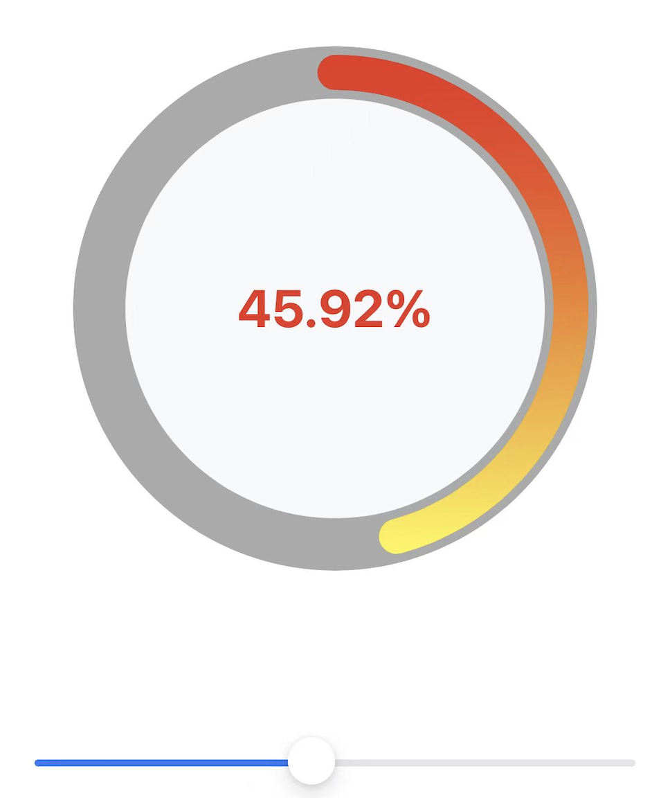

<div align="center" >
  
</div>

# SFCircleProgressView

[](https://travis-ci.org/SparkeXHApp/SFCircleProgressView)
[](https://cocoapods.org/pods/SFCircleProgressView)
[](https://cocoapods.org/pods/SFCircleProgressView)
[](https://cocoapods.org/pods/SFCircleProgressView)

## Introduction

支持的属性：
- progress，进度 0.0 ~ 1.0
- lineWith，背景线宽
- lineColor，背景线色
- proLineWith，进度线宽
- proColors，进度线色，支持渐变
- text，中间文字内容
- textColor，文字颜色
- textFont，文字字体

## Example

To run the example project, clone the repo, and run `pod install` from the Example directory first.

## Requirements

* iOS 12.0 or later
* Swift 5.9.2
* Xcode 15.1

## Installation

SFCircleProgressView is available through [CocoaPods](https://cocoapods.org). To install
it, simply add the following line to your Podfile:

```ruby
pod 'SFCircleProgressView', :git => 'https://github.com/Sfh03031/SFCircleProgressView.git'
```

## Author

  Sfh03031, sfh894645252@163.com

## License

SFCircleProgressView is available under the MIT license. See the LICENSE file for more info.
